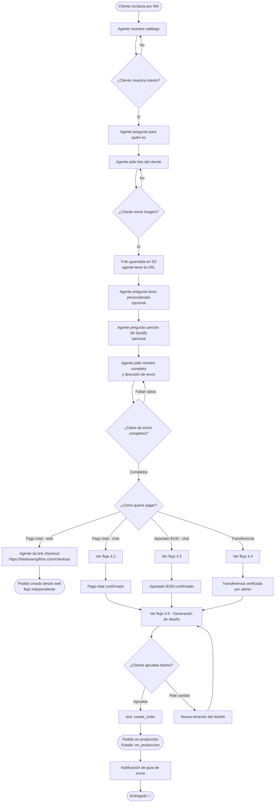
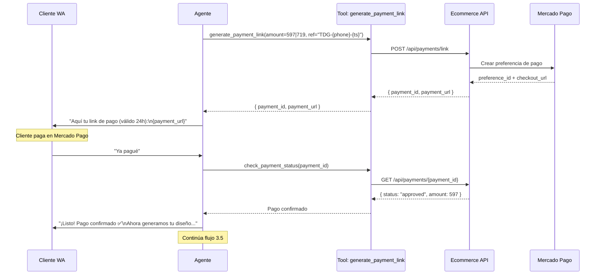
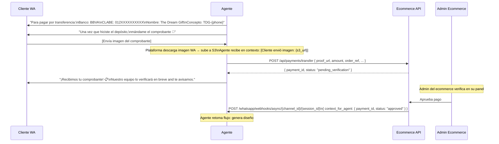
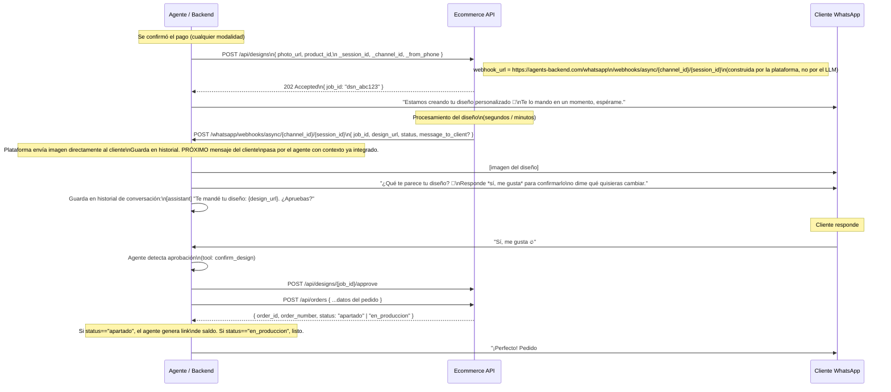
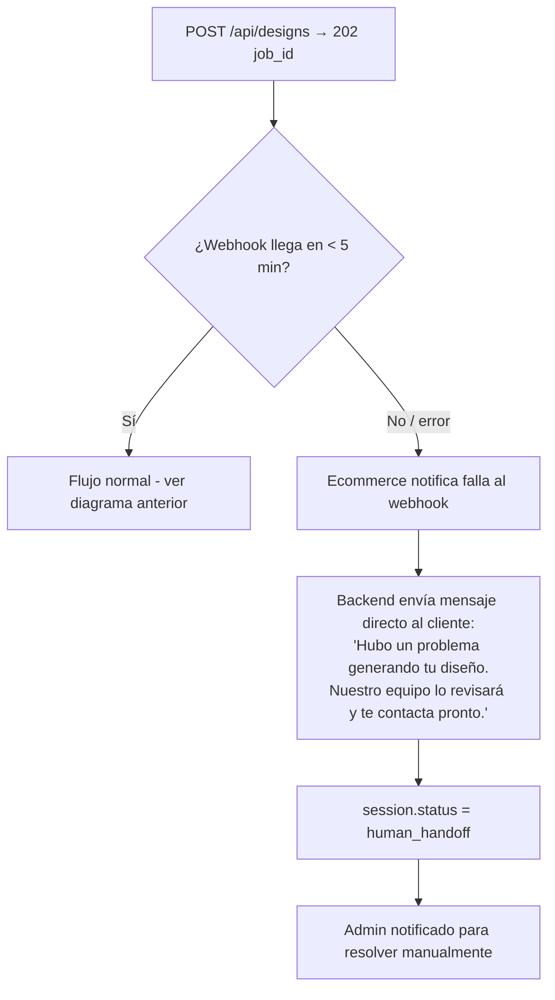

# The Dream Gift — Agente de Ventas WhatsApp (con checkout en chat)

> **Documento de diseño técnico**  
> Fecha: 10 de marzo de 2026  
> Versión: 2.0 — Arquitectura canónica  
> Audiencia: desarrollador de este backend + desarrollador del ecommerce externo

---

## Índice

1. [Principios de diseño](#1-principios-de-diseño)
2. [Resumen del sistema](#2-resumen-del-sistema)
3. [Estados del pedido (propuesta)](#3-estados-del-pedido-propuesta)
4. [Flujos principales](#4-flujos-principales)
   - 4.1 Flujo de venta completo
   - 4.2 Pago total por chat (Mercado Pago link)
   - 4.3 Apartado $100 + saldo restante (100% en chat)
   - 4.4 Transferencia bancaria → Human Handoff
   - 4.5 Generación de diseño (async con webhook)
   - 4.6 Consulta de estado de pedido
   - 4.7 Mecanismo de Human Handoff
5. [Nuevas features de plataforma (canónicas)](#5-nuevas-features-de-plataforma-canónicas)
   - 5.1 Builtin: `trigger_human_handoff`
   - 5.2 Inyección de contexto WhatsApp en tools
   - 5.3 Recepción de imágenes en WhatsApp
   - 5.4 Webhook genérico async para tools
6. [Cambios en archivos existentes](#6-cambios-en-archivos-existentes)
7. [API del Ecommerce externo](#7-api-del-ecommerce-externo)
8. [Configuración de tools desde el frontend](#8-configuración-de-tools-desde-el-frontend)
9. [Configuración del agente Dream Gift](#9-configuración-del-agente-dream-gift)
10. [Notas de implementación](#10-notas-de-implementación)

---

## 1. Principios de diseño

Este diseño tiene dos capas bien separadas:

| Capa | Qué es | Quién lo configura |
|------|--------|--------------------|
| **Plataforma** | Features genéricas que cualquier negocio puede usar: handoff, inyección de contexto, imágenes, webhook async | Desarrollador del backend (una sola vez) |
| **Negocio** | Prompt, tools, agente | Operador del negocio desde el frontend |

**Reglas que guían el diseño:**

1. **Nada hardcodeado para Dream Gift.** No se crea ningún archivo `.py` específico del negocio. Todo se configura vía la API de tools y el agente en el frontend.
2. **Las tools son HTTP genéricas.** La plataforma ya tiene `ToolsIntegration` que ejecuta cualquier tool como HTTP call. Las tools del agente se crean desde el frontend con URL, método, headers e `input_schema`.
3. **`trigger_human_handoff` es un builtin de la plataforma** — igual que `search_knowledge_base` ya existe como builtin. No es una llamada HTTP externa.
4. **La plataforma inyecta contexto de sesión automáticamente.** El LLM no necesita saber el `session_id` ni el `channel_id`. La plataforma los resuelve como templates en la URL de la tool antes de hacer el HTTP call.
5. **El webhook async es genérico.** Un endpoint `POST /whatsapp/webhooks/async/{channel_id}/{session_id}` sirve para cualquier negocio que tenga operaciones de larga duración — no solo diseños de lámparas.

---

## 2. Resumen del sistema

```
┌──────────────────────────────────────────────────────────────────────────┐
│                           CLIENTE (WhatsApp)                             │
└───────────────────────────────────┬──────────────────────────────────────┘
                                    │  mensajes + imágenes
                                    ▼
┌──────────────────────────────────────────────────────────────────────────┐
│                         PLATAFORMA (agents-ai)                           │
│                                                                          │
│  ┌──────────────────┐   ┌─────────────────────┐   ┌──────────────────┐  │
│  │  WhatsApp Route  │   │   Agent Executor    │   │   S3 Service     │  │
│  │  - msg texto     │──▶│   LLM + tools       │   │  (fotos/media)   │  │
│  │  - msg imagen ★  │   └──────────┬──────────┘   └──────────────────┘  │
│  │  - webhook async │             │ tool dispatch                       │
│  └──────────────────┘             │                                     │
│                          ┌────────▼────────────────────────┐            │
│                          │   _dispatch_tool                │            │
│                          │                                 │            │
│                          │  builtin:                       │            │
│                          │    search_knowledge_base        │            │
│                          │    trigger_human_handoff ★      │            │
│                          │    sub-agents                   │            │
│                          │                                 │            │
│                          │  HTTP genérico (ToolsIntegration│            │
│                          │    + context injection ★)       │            │
│                          └────────┬────────────────────────┘            │
└───────────────────────────────────┼──────────────────────────────────────┘
                                    │ HTTP (Bearer API_KEY)
                                    ▼
┌──────────────────────────────────────────────────────────────────────────┐
│                    SISTEMA EXTERNO (cualquier negocio)                   │
│                                                                          │
│  /api/payments/link    /api/payments/{id}    /api/designs                │
│  /api/designs/{id}/approve                  /api/designs/{id}/revision  │
│  /api/orders           /api/orders/{id}/pay-balance                     │
│  /api/orders/by-phone/{phone}                                           │
│                                                                          │
│  Callback → POST /whatsapp/webhooks/async/{channel_id}/{session_id} ★   │
└──────────────────────────────────────────────────────────────────────────┘
```

> ★ = feature nueva que agregar a la plataforma (sección 5)

### Datos que el agente recopila por chat (configuración Dream Gift)

| Campo               | Obligatorio | Notas                                       |
|---------------------|-------------|---------------------------------------------|
| Modelo de lámpara   | ✅          | LED $597 o Madera $719                      |
| Foto del cliente    | ✅          | Imagen enviada por WhatsApp → URL de S3     |
| Texto personalizado | ❌          | Opcional, máx ~30 caracteres                |
| Canción de Spotify  | ❌          | URL de Spotify o "Artista - Canción"        |
| Nombre completo     | ✅          | Para el pedido                              |
| Dirección de envío  | ✅          | Calle, número, colonia, ciudad, estado, CP  |
| Forma de pago       | ✅          | MP total / MP apartado $100 / Transferencia |

---

## 3. Estados del pedido (propuesta)

```mermaid
stateDiagram-v2
    direction LR
    [*] --> recopilando_datos : Cliente inicia pedido

    recopilando_datos --> esperando_pago : Datos completos

    esperando_pago --> apartado_pagado : Pago $100 confirmado (MP)
    esperando_pago --> pago_completo : Pago total confirmado (MP)
    esperando_pago --> verificando_transferencia : Cliente envía comprobante

    verificando_transferencia --> apartado_pagado : Admin aprueba (apartado)
    verificando_transferencia --> pago_completo : Admin aprueba (total)
    verificando_transferencia --> esperando_pago : Admin rechaza → cliente reintenta

    apartado_pagado --> diseño_en_proceso : Foto + diseño iniciado
    pago_completo --> diseño_en_proceso : Foto + diseño iniciado

    diseño_en_proceso --> diseño_enviado : Ecommerce llama webhook diseño-listo

    diseño_enviado --> diseño_aprobado : Cliente dice "sí / me gusta / apruebo"
    diseño_enviado --> diseño_en_proceso : Cliente pide cambio (nueva iteración)

    diseño_aprobado --> apartado_en_produccion : Pedido creado (pago parcial)
    diseño_aprobado --> en_produccion : Pedido creado (pago total)

    apartado_en_produccion --> saldo_pendiente : Agente genera link de saldo
    saldo_pendiente --> en_produccion : Cliente paga saldo + pay-balance confirmado

    en_produccion --> enviado : Guía DHL/Estafeta generada
    enviado --> entregado : Entrega confirmada

    entregado --> [*]
```



### Tabla de estados

| Estado                    | Descripción                                                    |
|---------------------------|----------------------------------------------------------------|
| `recopilando_datos`       | El agente está recopilando foto, texto, Spotify, dirección     |
| `esperando_pago`          | Datos completos, se generó link de pago o se dieron datos bancarios |
| `verificando_transferencia` | Cliente envió comprobante, sesión en **human handoff**       |
| `apartado_pagado`         | Se verificó pago de $100 MXN                                   |
| `pago_completo`           | Se verificó pago total                                         |
| `diseño_en_proceso`       | Foto enviada al ecommerce, generando diseño                    |
| `diseño_enviado`          | Diseño enviado al cliente, esperando aprobación                |
| `diseño_aprobado`         | Cliente aprobó, esperando crear pedido oficial                 |
| `apartado_en_produccion`  | Pedido creado con `status: "apartado"`, falta pagar el saldo   |
| `saldo_pendiente`         | Link de saldo generado, esperando confirmación de pago         |
| `en_produccion`           | Pago completo confirmado. Lámpara en fabricación               |
| `enviado`                 | Tiene guía de rastreo                                          |
| `entregado`               | Confirmado como entregado                                      |

---

## 4. Flujos principales

### 4.1 Flujo de venta completo



---

### 4.2 Pago total por chat (Mercado Pago link)



---

### 4.3 Apartado $100 por chat (Mercado Pago link)

Idéntico al 4.2 pero con `amount=100`. Una vez que el cliente aprueba el diseño, el agente genera un **segundo link de pago** con el saldo restante ($497 para LED o $619 para madera) antes de confirmar el pedido. Todo el proceso de pago ocurre dentro del chat — no se redirige a la web en ningún momento.

```
Apartado pagado ($100) → diseño generado → diseño aprobado por cliente
  → agente llama generate_payment_link(amount=497|619, payment_type="mp_balance")
  → cliente paga saldo restante dentro del chat
  → pago confirmado → create_order
```

---

### 4.4 Transferencia bancaria (sin handoff)

El flujo de transferencia ya no necesita handoff — la verificación es responsabilidad del ecommerce:



---

### 4.5 Generación de diseño (flujo async con webhook)

> Este es el caso más crítico de implementar correctamente porque el ecommerce puede tardar varios segundos.



#### Manejo de timeout / falla en generación de diseño



---

### 4.6 Consulta de estado de pedido

```mermaid
flowchart TD
    A([Cliente pregunta por su pedido]) --> B[Agente llama tool: get_order_status]
    B --> C[GET /api/orders/by-phone/{phone}]
    C --> D{¿Hay pedidos?}
    D -->|No| E[Agente: No encontramos pedidos con este número.\n¿Quieres hacer uno?]
    D -->|1 pedido| F[Agente muestra estado, fecha estimada y guía si aplica]
    D -->|Varios pedidos| G[Agente muestra lista con números de pedido\ny estado de cada uno]
    F --> H{¿Tiene guía de rastreo?}
    H -->|Sí| I[Agente incluye link de rastreo DHL/Estafeta]
    H -->|No| J[Agente informa tiempos estimados]
```

---

### 4.7 Mecanismo de Human Handoff

`trigger_human_handoff` es un **builtin de la plataforma** — se registra en `_dispatch_tool` igual que `search_knowledge_base`. Cuando el agente lo llama, la plataforma ejecuta la acción internamente sin hacer ningún HTTP call externo. Cualquier agente de cualquier negocio puede tenerla asignada.

### Qué hace

Cuando se activa el handoff:
1. `session.status` cambia a `"human_handoff"` — el agente deja de responder
2. Se agrega la etiqueta `"pendiente_revision"` a `session.labels`
3. La sesión aparece destacada en el panel admin
4. El admin responde manualmente usando la barra de envio del panel
5. Cuando termina, activa el agente con el toggle → `status = "active"`, etiqueta eliminada

### Sistema de etiquetas

`session.labels` es una lista libre de strings. Etiquetas automáticas del sistema:

| Etiqueta | Cuándo se agrega | Cuándo se elimina |
|---|---|---|
| `"pendiente_revision"` | Al activar handoff (builtin, toggle, falla async) | Al reactivar con toggle |
| `"comprobante_recibido"` | Cuando llega imagen durante handoff | Nunca automáticamente |

### Triggers para activar handoff

| Trigger | Quién lo activa |
|---------|----------------|
| Cliente solicita hablar con persona | Agente LLM (builtin `trigger_human_handoff`) |
| Falla en generación de diseño u operación async | Webhook async con `status: "failed"` |
| Admin activa manualmente | Panel admin (botón toggle en conversación) |

> El envío de comprobante de transferencia ya **no** activa handoff — el agente llama `register_transfer_proof` y el ecommerce verifica de forma autónoma.

### Toggle desde el panel

En la página de conversación hay un chip en el header que muestra el estado del agente:
- Chip **verde "Activo"** → click para desactivar (`status = "human_handoff"` + label `"pendiente_revision"`)
- Chip **ámbar "Desactivado"** → click para reactivar (`status = "active"` + label eliminado)

---

## 5. Nuevas features de plataforma (canónicas)

Cambios al **core de la plataforma** — no específicos de Dream Gift. Cualquier negocio con agente de WhatsApp puede usarlas una vez implementadas.

---

### 5.1 Builtin: `trigger_human_handoff`

**Dónde:** `app/integrations/agent_executor.py` → `_dispatch_tool`

Se reconoce por nombre igual que `search_knowledge_base` y ejecuta lógica interna sin hacer ningún HTTP call. Al ejecutarse: cambia `session.status` a `"human_handoff"` y agrega `"pendiente_revision"` a `session.labels`. No necesita parámetros del LLM — el `session_id` lo toma la plataforma del contexto de WhatsApp.

---

### 5.2 Inyección de contexto WhatsApp en tools

**Dónde:** `app/integrations/tools_integration.py` → `execute_tool`

El backend dispone de `session_id`, `channel_id` y `from_phone` en cada request de WhatsApp. Se inyectan de dos formas:

**A) Templates en la URL:** El operador configura la URL con placeholders `{_session_id}`, `{_channel_id}`, `{_from_phone}` que la plataforma resuelve antes del HTTP call. Ejemplo: `.../webhooks/async/{_channel_id}/{_session_id}`.

**B) Inyección silenciosa en el body:** Los valores se agregan al body automáticamente, sin aparecer en el `input_schema`. El LLM nunca los ve ni los pasa. Se inyectan: `_session_id`, `_channel_id`, y `whatsapp_phone` (el número del cliente).

---

### 5.3 Recepción de imágenes en WhatsApp

**Dónde:** `app/routers/whatsapp_route.py`

El webhook actualmente ignora `msg_type == "image"`. Con el cambio, al recibir imagen:
- Descarga de la Graph API de Meta → sube a S3 → obtiene URL permanente
- **Sesión activa:** pasa `[Cliente envió imagen: {s3_url}]` al agente (con caption si aplica)
- **Sesión en handoff:** guarda la URL en el mensaje, agrega label `"comprobante_recibido"`, responde confirmando recibo sin pasar al agente

---

### 5.4 Webhook genérico async para tools

**Dónde:** `app/routers/whatsapp_route.py` → `POST /whatsapp/webhooks/async/{channel_id}/{session_id}`

Punto de retorno para cualquier operación async (diseños, cotizaciones, etc.). Autenticado con `X-Webhook-Secret`. Body: `{ status: "ready"|"failed", message_to_client, context_for_agent, error_message }`.

- **`status: "ready"`:** envía `message_to_client` al cliente (texto o multi-mensaje con imágenes), guarda en historial. Si incluye `context_for_agent`, lo almacena como tool_result — el próximo mensaje del cliente llega al agente con ese contexto ya disponible (para Dream Gift: `{ design_job_id, design_url, design_status: "awaiting_approval" }`).
- **`status: "failed"`:** envía `error_message` al cliente y activa handoff automáticamente.

---

## 6. Cambios en archivos existentes

Todos los cambios son de plataforma — cero archivos específicos de Dream Gift.

| Archivo | Cambio |
|---------|--------|
| `app/routers/whatsapp_route.py` | Handling de `msg_type == "image"` + endpoint `POST /whatsapp/webhooks/async/{channel_id}/{session_id}` + endpoint `POST /whatsapp/sessions/{id}/toggle` |
| `app/services/whatsapp_service.py` | En `process_incoming_message`: skip agente cuando `status == "human_handoff"`; `toggle_session_agent()` |
| `app/integrations/agent_executor.py` | Pasar `whatsapp_context` a `_dispatch_tool`; registrar `trigger_human_handoff` como builtin |
| `app/integrations/tools_integration.py` | Parámetro `whatsapp_context` en `execute_tool`; template resolution en URL; inyección silenciosa de `_session_id`, `_channel_id`, `_from_phone` |
| `app/integrations/whatsapp_client.py` | Método `download_media(media_id, wa_token)` |
| `app/models/whatsapp.py` | Campo `status: "active" | "human_handoff"` ya existe; agregar: `labels: list[str] = []` |
| `app/repositories/whatsapp_repository.py` | Agregar `add_labels_to_session(session_id, labels)` con `list_append(if_not_exists(...))` |

---

## 7. API del Ecommerce externo

> Spec completa: **ECOMMERCE_API_SPEC.md**. Base URL almacenada en `ECOMMERCE_API_BASE_URL`. Todos los endpoints requieren `Authorization: Bearer {ECOMMERCE_API_KEY}`.

### 7.1 Pagos

| Endpoint | Método | Descripción | Parámetros clave |
|---|---|---|---|
| `/api/payments/link` | POST | Crea link de Mercado Pago | `amount`, `concept`, `order_ref` · `whatsapp_phone`, `_session_id`, `_channel_id` inyectados |
| `/api/payments/transfer` | POST | Registra comprobante de transferencia | `amount`, `concept`, `order_ref`, `proof_url` (URL S3 de la imagen) · `whatsapp_phone`, `_session_id`, `_channel_id` inyectados · devuelve `status: "pending_verification"` |
| `/api/payments?payment_id={id}` | GET | Consulta estado | `payment_id` (query param) · `status: pending\|pending_verification\|approved\|rejected\|expired` |

### 7.2 Diseños

| Endpoint | Método | Descripción | Parámetros clave |
|---|---|---|---|
| `/api/designs` | POST | Inicia generación async | `photo_url`, `product_id` · `_session_id`, `_channel_id`, `whatsapp_phone` inyectados · Response 202: `job_id` |
| `/api/designs?job_id={id}` | GET | Polling opcional | `job_id` (query param) · `status: processing\|ready\|failed` |
| `/api/designs/approve` | POST | Confirma diseño aprobado | `job_id` · Response: `{ approved: true }` |
| `/api/designs/revision` | POST | Solicita cambio | `job_id`, `change_notes` · Response 202: nuevo `job_id` |

### 7.3 Pedidos

Flujo: `create_order` (solo pago + teléfono) → `update_order` (llenar datos) → `confirm_order` (valida y pasa a `en_produccion`).

| Endpoint | Método | Descripción | Parámetros clave |
|---|---|---|---|
| `/api/orders` | POST | Crea pedido inicial | `payment_id` · `whatsapp_phone` inyectado · Response: `order_id`, `order_number`, `status: "apartado"` |
| `/api/orders` | PATCH | Actualiza campos del pedido | `order_id` (requerido) + cualquier campo: `product_id`, `design_job_id`, `customer_name`, dirección, `custom_text`, `spotify_ref`, `email`, `balance_payment_id` |
| `/api/orders/confirm` | POST | Valida y confirma pedido | `order_id` · Response: `status: "en_produccion"` o error con `missing_fields` |
| `/api/orders?order_id={id}` | GET | Detalle del pedido | `order_id` (query param) · incluye `missing_fields[]` y `ready_to_confirm: bool` |
| `/api/orders/by-whatsapp?whatsapp_phone={phone}` | GET | Pedidos del cliente | `whatsapp_phone` resuelto desde `{whatsapp_phone}` en URL · Array con `status`, `tracking_url` |
| `/api/orders/by-email?email={email}` | GET | Pedidos por correo | `email` del LLM · Misma estructura |

> **Flujo apartado:** `create_order` → `status: "apartado"` → completar datos con `update_order` + segundo pago → `confirm_order` → `status: "en_produccion"`.

### 7.4 Callback del ecommerce → plataforma

`POST /whatsapp/webhooks/async/{channel_id}/{session_id}` — ver sección 5.4. El ecommerce obtiene `_channel_id` y `_session_id` de los parámetros inyectados por la plataforma en el request de `generate_design`.

---

## 8. Configuración de tools desde el frontend

Las tools se crean desde el panel (sin archivos Python específicos de Dream Gift). `trigger_human_handoff` es builtin — solo asignarla al agente, no registrar como tool HTTP.

| Tool | URL / Endpoint | Método | Parámetros del LLM |
|---|---|---|---|
| `generate_payment_link` | `.../api/payments/link` | POST | `amount`, `concept`, `order_ref` · `whatsapp_phone`, `_session_id`, `_channel_id` inyectados |
| `register_transfer_proof` | `.../api/payments/transfer` | POST | `amount`, `concept`, `order_ref`, `proof_url` (S3 URL de imagen) · `whatsapp_phone`, etc. inyectados |
| `check_payment_status` | `.../api/payments?payment_id={payment_id}` | GET | `payment_id` (resuelto como query param) |
| `generate_design` | `.../api/designs` | POST | `photo_url`, `product_id` · `_session_id`, `_channel_id`, `whatsapp_phone` inyectados |
| `check_design_status` | `.../api/designs?job_id={job_id}` | GET | `job_id` (query param, polling opcional) |
| `approve_design` | `.../api/designs/approve` | POST | `job_id` |
| `request_design_revision` | `.../api/designs/revision` | POST | `job_id`, `change_notes` |
| `create_order` | `.../api/orders` | POST | `payment_id` · `whatsapp_phone` inyectado |
| `get_order_status` | `.../api/orders?order_id={order_id}` | GET | `order_id` (query param) |
| `update_order` | `.../api/orders` | PATCH | `order_id` + cualquier campo a actualizar (`product_id`, `design_job_id`, dirección, `balance_payment_id`, etc.) |
| `confirm_order` | `.../api/orders/confirm` | POST | `order_id` |
| `get_orders_by_whatsapp` | `.../api/orders/by-whatsapp?whatsapp_phone={whatsapp_phone}` | GET | Sin parámetros del LLM — URL usa `{whatsapp_phone}` inyectado |
| `get_orders_by_email` | `.../api/orders/by-email?email={email}` | GET | `email` |
| `trigger_human_handoff` | *(builtin)* | — | Sin parámetros |

> URL base: `https://api.thedreamgiftmx.com` · Headers: `Authorization: Bearer {ECOMMERCE_API_KEY}` en todas.

---

## 9. Configuración del agente Dream Gift


Todo se configura desde el frontend — cero código nuevo.

### Agente

| Campo | Valor |
|-------|-------|
| **Nombre** | The Dream Gift — Ventas WhatsApp |
| **Prompt** | Contenido de `prompt_dream_gift_sales_chat.txt` (a crear) |
| **Modelo** | El mismo que el agente actual de Dream Gift |
| **whatsapp_enabled** | `true` |
| **Tools asignadas** | `generate_payment_link`, `check_payment_status`, `generate_design`, `confirm_design`, `request_design_revision`, `create_order`, `get_order_status`, `trigger_human_handoff` |

### Canal de WhatsApp

Mismo canal existente. Solo cambiar `agent_id` para apuntar al nuevo agente.

### Prompt — diferencias clave vs. el prompt actual

| Aspecto | Prompt actual | Prompt nuevo (con checkout) |
|---------|---------------|-----------------------------|
| Checkout | Solo envía link de web | Procesa pago en chat (MP link) |
| Foto del cliente | No recopila | Solicita imagen por WA |
| Datos de envío | No recopila | Los pide por chat |
| Texto / Spotify | No menciona | Pregunta como opcionales |
| Transferencia | No maneja | Da datos bancarios → handoff |
| Estado de pedido | No puede consultar | Usa `get_order_status` |
| Diseño | No involucrado | Gestiona aprobación / revisión |
| Apartado | No aplica | $100 → diseño → saldo → pedido |

### Estructura del prompt nuevo

```
## Quién eres
## Cómo escribir (igual al actual)
## Catálogo (igual al actual)
## Formas de compra
   - Por la página web (ruta corta — solo dar el link)
   - Por el chat (ruta completa — checkout dentro de WhatsApp)
## Proceso de venta por chat (paso a paso)
   1. Mostrar producto → esperar señal de compra
   2. Preguntar para quién es
   3. Pedir foto (imagen de WhatsApp)
   4. Texto personalizado (opcional — pregunta natural)
   5. Canción de Spotify (opcional — URL o "Artista - Canción")
   6. Nombre completo y dirección de envío
   7. Presentar opciones de pago (MP total / MP apartado $100 / Transferencia)
## Manejo de pagos
   - MP link: llamar generate_payment_link → compartir URL → verificar con check_payment_status
   - Transferencia: dar datos bancarios → pedir comprobante → llamar trigger_human_handoff
   - Apartado: $100 primero → diseño → saldo restante → create_order
## Diseño
   - Después de confirmar pago: llamar generate_design
   - Cuando llega el diseño (ya estará en el historial): preguntar aprobación
   - Si aprueba: llamar confirm_design → create_order
   - Si pide cambio: llamar request_design_revision
## Consulta de pedidos
   - Cuando el cliente pregunte por su pedido: llamar get_order_status
## Objeciones (igual al actual)
## Reglas absolutas
   - Nunca inventar precios, descuentos ni tiempos
   - No pedir datos de tarjeta — solo se usa el link de MP
   - No compartir datos bancarios de la empresa fuera del flujo de transferencia
## Mensajería enriquecida (igual al actual)
```

---

## 10. Notas de implementación

### Orden de implementación sugerido

```
Fase 1 — Features de plataforma (sin ecommerce, sin Dream Gift específico)
  [ ] 5.1: Builtin trigger_human_handoff en _dispatch_tool
  [ ] 5.2: Context injection en ToolsIntegration (whatsapp_context, URL templates)
  [ ] 5.3: Handling de img en webhook WA (download_media → S3 → message_text)
  [ ] 5.4: Endpoint POST /whatsapp/webhooks/async/{channel_id}/{session_id}
  [ ] Endpoint POST /whatsapp/sessions/{id}/toggle + toggle_session_agent() en service
  [ ] Skip agente cuando session.status == "human_handoff"

Fase 2 — Configurar Dream Gift en el frontend (sin ecommerce real aún)
  [ ] Crear tools con URLs apuntando a mocks/stubs
  [ ] Crear agente con prompt_dream_gift_sales_chat.txt
  [ ] Asignar tools + canal WhatsApp
  [ ] Probar flujo completo con mocks

Fase 3 — Ecommerce implementa sus endpoints
  [ ] POST /api/payments/link + GET /api/payments/{id}
  [ ] POST /api/designs + callback async
  [ ] POST /api/designs/{id}/approve + POST /api/designs/{id}/revision
  [ ] POST /api/orders + GET /api/orders/by-phone/{phone}

Fase 4 — Actualizar tools en el frontend con URLs reales
  [ ] Cambiar URLs de stubs a producción del ecommerce
  [ ] Prueba end-to-end

Fase 5 — Pulido
  [ ] Panel admin: badge de sesiones en handoff
  [ ] Timeout handling: si async webhook no llega en X min → handoff automático
  [ ] Logs y monitoreo de tool calls
```

### Datos bancarios para transferencia

Configurar directamente en el prompt del agente (no en código):
- Banco, CLABE, nombre del titular
- Concepto de referencia: `TDG-{número de teléfono}`

---

*Fin del documento — v2.0*
